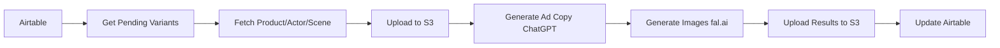

# 🎨 Cyclon2 - AI Ad Generation Automation

> **ADHD-Friendly** n8n automation pipeline for generating AI-powered ads with Airtable, ChatGPT, and fal.ai

## 🎯 What This Does

Automatically generates 3 unique ad variants by:
1. **Reading** from Airtable (products, actors, scenes)
2. **Uploading** images to S3
3. **Generating** ad copy with ChatGPT
4. **Creating** images with fal.ai img2img (strength: 0.65)
5. **Looping** 3x for variants
6. **Writing** back to Airtable

## 📁 Project Structure

```
cyclon2/
├── workflows/          # n8n workflow JSON exports
├── config/            # API keys, schemas, prompts
│   ├── .env.example   # Template for environment variables
│   ├── airtable-schema.json
│   └── prompts.json   # ChatGPT prompt templates
├── utils/             # Helper utilities
│   ├── airtable/      # Airtable CRUD operations
│   ├── s3/           # S3 upload/download
│   └── retry.ts      # Retry logic with exponential backoff
├── types/            # TypeScript schemas
│   └── schemas.ts    # Actor, Scene, Product, AdCopy types
└── scripts/          # Automation scripts
    ├── deploy.js     # Deploy workflows to n8n
    ├── backup.js     # Backup Airtable & S3 data
    └── validate-config.js  # Validate configuration
```

## 🚀 Quick Start

### 1️⃣ Install Dependencies

```bash
npm install
```

### 2️⃣ Configure Environment

```bash
# Copy example config
cp config/.env.example .env

# Edit .env with your API keys
nano .env
```

**Required API Keys:**
- Airtable API key & Base ID
- AWS S3 credentials
- OpenAI API key
- fal.ai API key

**Optional:**
- 11Labs API key (for voice)
- n8n Cloud API key

### 3️⃣ Validate Configuration

```bash
npm run validate
```

This checks:
- ✅ All API keys are set
- ✅ Config files are valid JSON
- ✅ Workflows are properly formatted

### 4️⃣ Set Up Airtable

Create 5 tables in Airtable:

1. **Actors** - People in ads
   - Fields: `name`, `imageUrl`, `description`, `voiceId`, `tags`

2. **Scenes** - Ad settings
   - Fields: `name`, `description`, `imageUrl`, `style`, `tags`

3. **Products** - Items to advertise
   - Fields: `name`, `description`, `imageUrl`, `price`, `category`, `features`

4. **AdCopies** - Generated text
   - Fields: `productId`, `headline`, `body`, `callToAction`, `tone`, `length`

5. **AdVariants** - Complete ads
   - Fields: `productId`, `actorId`, `sceneId`, `status`, `generatedImageUrl`, `variantNumber`

> 💡 See `config/airtable-schema.json` for detailed field configurations

### 5️⃣ Import Workflow to n8n

```bash
npm run deploy
```

Then:
1. Go to [n8n Cloud](https://app.n8n.cloud)
2. Click **Import Workflow**
3. Upload `workflows/ai-ad-generation-pipeline.json`
4. Configure credentials:
   - Airtable API
   - AWS S3
   - OpenAI API
   - fal.ai API (use HTTP Request with Bearer token)

### 6️⃣ Activate Workflow

In n8n:
1. Open the imported workflow
2. Click **Activate** toggle (top-right)
3. Test with manual trigger or wait for schedule

## 🎨 How It Works

### Pipeline Flow



### Key Settings

- **fal.ai img2img strength**: `0.65` (balance between original & AI)
- **Variants per product**: `3`
- **ChatGPT model**: `gpt-4` (configurable)
- **Retry attempts**: `3` with exponential backoff

## 🛠️ Utilities

### TypeScript Helpers

```typescript
import { AirtableHelper } from './utils/airtable/helper';
import { S3Helper } from './utils/s3/helper';
import { withRetry } from './utils/retry';

// Airtable operations
const airtable = new AirtableHelper(apiKey, baseId);
const variants = await airtable.getPendingAdVariants();

// S3 uploads
const s3 = new S3Helper({ region, bucket, accessKeyId, secretAccessKey });
const url = await s3.uploadFromUrl(imageUrl, 'ads/my-ad.png');

// Retry logic
const result = await withRetry(
  () => riskyOperation(),
  { maxRetries: 3, initialDelay: 1000 }
);
```

## 📦 Scripts

### Backup Data

```bash
npm run backup
```

Saves to `backups/YYYY-MM-DD/`:
- Airtable data (all tables)
- S3 file list
- Configuration files
- Workflows

### Deploy Workflows

```bash
npm run deploy
```

Prepares workflows for n8n import (manual upload required).

### Validate Config

```bash
npm run validate
```

Checks all environment variables and configuration files.

## 🔧 Development

### Build TypeScript

```bash
npm run build
```

Compiles TypeScript to `dist/` directory.

### Watch Mode

```bash
npm run dev
```

Auto-recompiles on file changes.

## 📝 TypeScript Schemas

### Actor
```typescript
interface Actor {
  id: string;
  name: string;
  imageUrl: string;
  description: string;
  voiceId?: string;
  tags: string[];
}
```

### Scene
```typescript
interface Scene {
  id: string;
  name: string;
  description: string;
  style: string;
  tags: string[];
}
```

### Product
```typescript
interface Product {
  id: string;
  name: string;
  description: string;
  price?: number;
  category: string;
  features: string[];
}
```

### AdVariant
```typescript
interface AdVariant {
  id: string;
  productId: string;
  actorId: string;
  sceneId: string;
  status: 'pending' | 'generating' | 'complete' | 'failed';
  variantNumber: number; // 1, 2, or 3
  generatedImageUrl?: string;
}
```

## 🎯 ADHD-Friendly Features

### ✅ Clear Structure
- Organized folders with single purpose
- One file = one responsibility
- No hidden complexity

### ✅ Visual Feedback
- Color-coded terminal output
- Progress indicators
- Clear error messages

### ✅ Step-by-Step Process
- Numbered steps in scripts
- Checklists in documentation
- Validation before execution

### ✅ Solo-Operator Simple
- Minimal configuration needed
- Automatic retries
- Self-documenting code

## 🔐 Security Notes

- Never commit `.env` file (already in `.gitignore`)
- Use environment variables for all secrets
- Rotate API keys regularly
- Use least-privilege IAM roles for AWS

## 🐛 Troubleshooting

### "API key not set"
- Check `.env` file exists
- Verify variables are not empty
- Run `npm run validate`

### "Workflow import failed"
- Ensure n8n credentials are configured
- Check API endpoint URLs
- Verify JSON is valid

### "Image generation failed"
- Check fal.ai API key
- Verify image URLs are accessible
- Try reducing img2img strength

### "Airtable rate limit"
- Add delays between requests
- Reduce batch size
- Use Airtable's enterprise plan

## 📚 API References

- [n8n Documentation](https://docs.n8n.io/)
- [Airtable API](https://airtable.com/developers/web/api/introduction)
- [OpenAI API](https://platform.openai.com/docs/api-reference)
- [fal.ai Docs](https://fal.ai/docs)
- [AWS S3 SDK](https://docs.aws.amazon.com/AWSJavaScriptSDK/latest/AWS/S3.html)
- [11Labs API](https://docs.elevenlabs.io/)

## 🤝 Contributing

This is a solo-operator project, but suggestions welcome!

## 📄 License

MIT

## 🎉 Credits

Built for efficient, ADHD-friendly automation workflows.